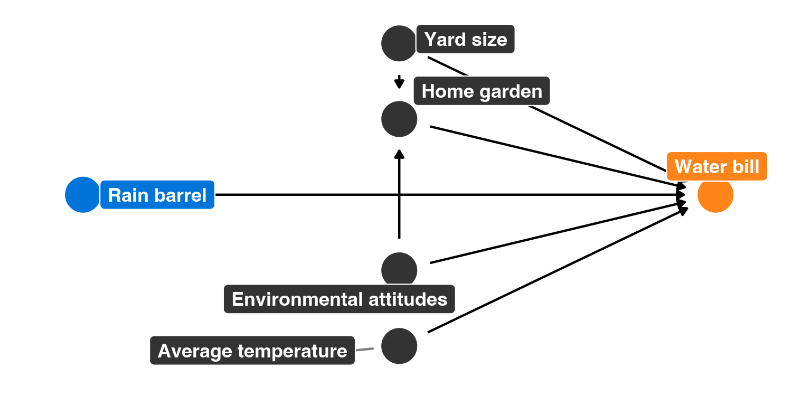

README
================
Lindsey Dorson

# Program overview

The metropolitan Atlanta area is interested in helping residents become
more environmentally conscious, reduce their water consumption, and save
money on their monthly water bills. To do this, Fulton, DeKalb,
Gwinnett, Cobb, and Clayton counties have jointly initiated a new
program that provides free rain barrels to families who request them.
These barrels collect rain water, and the reclaimed water can be used
for non-potable purposes (like watering lawns and gardens). Officials
hope that families that use the barrels will rely more on rain water and
will subsequently use fewer county water resources, thus saving both the
families and the counties money.

Being evaluation-minded, the counties hired an evaluator (you!) before
rolling out their program. You convinced them to fund and run a
randomized controlled trial (RCT) during 2018, and the counties rolled
out the program city-wide in 2019. You have two datasets:
`barrels_rct.csv` with data from the RCT, and `barrels_obs.csv` with
observational data from self-selected participants.

These datasets contain the following variables:

-   `id`: A unique ID number for each household
-   `water_bill`: The family’s average monthly water bill, in dollars
-   `barrel`: An indicator variable showing if the family participated
    in the program
-   `barrel_num`: A 0/1 numeric version of `barrel`
-   `yard_size`: The size of the family’s yard, in square feet
-   `home_garden`: An indicator variable showing if the family has a
    home garden
-   `home_garden_num`: A 0/1 numeric version of `home_garden`
-   `attitude_env`: The family’s self-reported attitude toward the
    environment, on a scale of 1-10 (10 meaning highest regard for the
    environment)
-   `temperature`: The average outside temperature (these get wildly
    unrealistic for the Atlanta area; just go with it)

# Your goal

Your task in this problem set is to analyze these two datasets to find
the causal effect (or average treatment effect (ATE)) of this
hypothetical program.

As a reference, Figure 1 shows the DAG for the program:


------------------------------------------------------------------------

``` r
library(tidyverse)
library(broom)
library(patchwork)
library(MatchIt)
library(modelsummary)
library(kableExtra)

barrels_rct <- read_csv("data/barrels_rct.csv") %>% 
  # This makes it so "No barrel" is the reference category
  mutate(barrel = fct_relevel(barrel, "No barrel"))

barrels_obs <- read_csv("data/barrels_observational.csv") %>% 
  # This makes it so "No barrel" is the reference category
  mutate(barrel = fct_relevel(barrel, "No barrel"))
```

# 1. Finding causation from a randomized controlled trial

## Modified DAG

You remember from PMAP 8521 that when running an RCT, you can draw the
DAG for the program like this (Figure 2). **Why?**

 Randomized
experiments get rid of confounding variables because there should be no
difference in the people selected into treatment and control
groups(equal distribution of characteristics).

## Check balance

**Discuss the sample size for the RCT data and how many people were
assigned to treatment/control. Are you happy with this randomization?**

``` r
barrels_rct%>%
  count(barrel)%>%
  mutate(prop =n /sum(n))
```

    ## # A tibble: 2 × 3
    ##   barrel        n  prop
    ##   <fct>     <int> <dbl>
    ## 1 No barrel   221 0.448
    ## 2 Barrel      272 0.552

``` r
table(barrels_rct$barrel) %>% prop.test() %>% tidy()
```

    ## # A tibble: 1 × 8
    ##   estimate statistic p.value parameter conf.low conf.high method         alter…¹
    ##      <dbl>     <dbl>   <dbl>     <int>    <dbl>     <dbl> <chr>          <chr>  
    ## 1    0.448      5.07  0.0243         1    0.404     0.493 1-sample prop… two.si…
    ## # … with abbreviated variable name ¹​alternative

Based on the results, there is statistical difference between the two
groups.

**Check the balance of the main pre-treatment characteristics. Are you
happy with the balance?**

``` r
barrels_rct %>%
  group_by(barrel) %>%
  summarize(yard_avg = mean(yard_size),
            home_avg = mean(home_garden_num),
            attitude_avg = mean(attitude_env),
            temp_avg = mean(temperature))
```

    ## # A tibble: 2 × 5
    ##   barrel    yard_avg home_avg attitude_avg temp_avg
    ##   <fct>        <dbl>    <dbl>        <dbl>    <dbl>
    ## 1 No barrel   21309.    0.267         5.52     69.6
    ## 2 Barrel      20357.    0.206         5.42     69.8

``` r
plot_diff_garden <- ggplot(barrels_rct, aes(x = barrel, y = home_garden_num, color = barrel)) +
  stat_summary(geom = "pointrange", fun.data = "mean_se", fun.args = list(mult = 1.96)) +
  guides(color = "none") +
  labs(x = NULL, y = "Proportion garden")

plot_prop_garden <- ggplot(barrels_rct, aes(x = barrel, fill = home_garden)) +
geom_bar(position = "fill") +
labs(x = NULL, y = "Proportion", fill = NULL) +
scale_fill_manual(values = c("darkblue", "darkred"))

plot_diff_garden + plot_prop_garden
```

<!-- -->

``` r
plot_diff_yard <- ggplot(barrels_rct, aes(x = barrel, y = yard_size, color = barrel)) +
  stat_summary(geom = "pointrange", fun.data = "mean_se", fun.args = list(mult = 1.96)) +
  guides(color = "none") +
  labs(x = NULL, y = "Yard Size")


plot_hist_yard <- ggplot(barrels_rct, aes(x = yard_size, fill = barrel)) +
  geom_histogram(binwidth = 1000) +
  guides(fill = "none") +
  labs(x = "Yard Size", y = "Count") +
  facet_wrap(vars(barrel), ncol = 1)

plot_diff_yard + plot_hist_yard
```

<!-- -->

``` r
plot_diff_env <- ggplot(barrels_rct, aes(x = barrel, y = attitude_env, color = barrel)) +
  stat_summary(geom = "pointrange", fun.data = "mean_se", fun.args = list(mult = 1.96)) +
  guides(color = "none") +
  labs(x = NULL, y = "Attitude toward the environment")

plot_hist_env <- ggplot(barrels_rct, aes(x = attitude_env, fill = barrel)) +
  geom_histogram(binwidth = 1, color = "white") +
  guides(fill = "none") +
  labs(x = "Attitude toward the environment", y = "Count") +
  facet_wrap(vars(barrel), ncol = 1)

plot_diff_env + plot_hist_env
```

<!-- -->

``` r
##check temperature without graph
t.test(temperature ~ barrel, data = barrels_rct) %>% tidy()
```

    ## # A tibble: 1 × 10
    ##   estim…¹ estim…² estim…³ stati…⁴ p.value param…⁵ conf.…⁶ conf.…⁷ method alter…⁸
    ##     <dbl>   <dbl>   <dbl>   <dbl>   <dbl>   <dbl>   <dbl>   <dbl> <chr>  <chr>  
    ## 1  -0.174    69.6    69.8  -0.383   0.702    486.   -1.07   0.719 Welch… two.si…
    ## # … with abbreviated variable names ¹​estimate, ²​estimate1, ³​estimate2,
    ## #   ⁴​statistic, ⁵​parameter, ⁶​conf.low, ⁷​conf.high, ⁸​alternative

All variables do not appear to have any huge variations between group
types.

## Estimate difference

**What is the effect of the program on participants’ water bills? How
credible is this result?**

``` r
model_rct <- lm(water_bill~barrel_num, data = barrels_rct)
tidy(model_rct)
```

    ## # A tibble: 2 × 5
    ##   term        estimate std.error statistic  p.value
    ##   <chr>          <dbl>     <dbl>     <dbl>    <dbl>
    ## 1 (Intercept)    228.       2.04     112.  0       
    ## 2 barrel_num     -40.6      2.74     -14.8 3.55e-41

The rain barrel program caused a statistically significant decrease of
\$40.57 in water bills, on average. These results can be given a causal
interpretation due to the randomized experiment design.

# 2. Finding causation from observational data

## Naive difference in means

**As a baseline measure, calculate the average difference in water bills
for those in the program and those not in the program using the
observational data. How much of an effect is there? How credible is this
result? Why?**

``` r
naive<- lm(water_bill ~ barrel_num, data = barrels_obs)
tidy(naive)
```

    ## # A tibble: 2 × 5
    ##   term        estimate std.error statistic  p.value
    ##   <chr>          <dbl>     <dbl>     <dbl>    <dbl>
    ## 1 (Intercept)    225.       1.07     211.  0       
    ## 2 barrel_num     -29.9      1.67     -17.8 1.61e-63

Those who used barrels saved \$29.86 on their water bills, on average.
However, a causal affect cannot be attributed to this estimate since
there are confounding variables that need to be controlled and there is
self selection.

## Adjustment with Mahalanobis nearest-neighbor matching

**Use matching to make the proper adjustments and close the backdoor
effects from the four main confounders: `yard_size`, `home_garden`,
`attitude_env`, and `temperature`**

``` r
matched <- matchit(barrel_num ~ yard_size + home_garden_num + attitude_env + temperature,
                        data = barrels_obs,
                        method = "nearest",
                        distance = "mahalanobis",
                        replace = TRUE)
summary(matched)
```

    ## 
    ## Call:
    ## matchit(formula = barrel_num ~ yard_size + home_garden_num + 
    ##     attitude_env + temperature, data = barrels_obs, method = "nearest", 
    ##     distance = "mahalanobis", replace = TRUE)
    ## 
    ## Summary of Balance for All Data:
    ##                 Means Treated Means Control Std. Mean Diff. Var. Ratio
    ## yard_size          21173.5505    20166.7283          0.1192     1.0373
    ## home_garden_num        0.2574        0.1848          0.1661          .
    ## attitude_env           5.5426        5.1196          0.2078     1.0604
    ## temperature           71.7804       68.6484          0.6243     1.1025
    ##                 eCDF Mean eCDF Max
    ## yard_size          0.0368   0.0706
    ## home_garden_num    0.0726   0.0726
    ## attitude_env       0.0423   0.1058
    ## temperature        0.1284   0.2692
    ## 
    ## 
    ## Summary of Balance for Matched Data:
    ##                 Means Treated Means Control Std. Mean Diff. Var. Ratio
    ## yard_size          21173.5505    21082.9505          0.0107     1.0600
    ## home_garden_num        0.2574        0.2574          0.0000          .
    ## attitude_env           5.5426        5.5347          0.0039     1.0316
    ## temperature           71.7804       71.5305          0.0498     1.1064
    ##                 eCDF Mean eCDF Max Std. Pair Dist.
    ## yard_size          0.0098   0.0337          0.1454
    ## home_garden_num    0.0000   0.0000          0.0000
    ## attitude_env       0.0059   0.0178          0.0486
    ## temperature        0.0114   0.0475          0.1692
    ## 
    ## Sample Sizes:
    ##               Control Treated
    ## All            736.       505
    ## Matched (ESS)  208.52     505
    ## Matched        300.       505
    ## Unmatched      436.         0
    ## Discarded        0.         0

``` r
matched_data <-match.data(matched)

model_matched_wts<-lm(water_bill~barrel_num,
                  data = matched_data,
                  weights = weights)

tidy(model_matched_wts)
```

    ## # A tibble: 2 × 5
    ##   term        estimate std.error statistic  p.value
    ##   <chr>          <dbl>     <dbl>     <dbl>    <dbl>
    ## 1 (Intercept)    234.       1.68     140.  0       
    ## 2 barrel_num     -39.4      2.12     -18.6 1.46e-64

## Adjustment with inverse probability weighting

**Use inverse probability weighting to make the proper adjustments and
close the backdoor effects from the four main confounders: `yard_size`,
`home_garden`, `attitude_env`, and `temperature`**

``` r
inverse <- glm(barrel_num ~ yard_size + home_garden_num + attitude_env + temperature,
                 data = barrels_obs,
                 family = binomial(link = "logit"))
```

``` r
probabilities <- augment_columns(inverse,
                                     barrels_obs,
                                     type.predict = "response") %>%
  rename(propensity = .fitted)

probabilities %>%
  select(id, barrel_num, yard_size, home_garden_num, attitude_env, temperature, propensity) %>%
  head()
```

    ## # A tibble: 6 × 7
    ##      id barrel_num yard_size home_garden_num attitude_env temperature propensity
    ##   <dbl>      <dbl>     <dbl>           <dbl>        <dbl>       <dbl>      <dbl>
    ## 1     1          1     25811               0            3        81.1      0.705
    ## 2     2          0     39479               1            7        65.1      0.354
    ## 3     3          1     13297               0            7        75.9      0.629
    ## 4     4          0     28259               0            2        70.6      0.339
    ## 5     5          1     21479               0            5        66.7      0.292
    ## 6     6          1     28906               1            8        75.3      0.686

``` r
ipw <- probabilities %>%
  mutate(ipw = (barrel_num / propensity) + ((1 - barrel_num) / (1 - propensity)))

ipw %>%
  select(id, barrel_num, yard_size, home_garden_num, attitude_env, temperature, propensity,ipw) %>%
  head()
```

    ## # A tibble: 6 × 8
    ##      id barrel_num yard_size home_garden_num attitude_env temper…¹ prope…²   ipw
    ##   <dbl>      <dbl>     <dbl>           <dbl>        <dbl>    <dbl>   <dbl> <dbl>
    ## 1     1          1     25811               0            3     81.1   0.705  1.42
    ## 2     2          0     39479               1            7     65.1   0.354  1.55
    ## 3     3          1     13297               0            7     75.9   0.629  1.59
    ## 4     4          0     28259               0            2     70.6   0.339  1.51
    ## 5     5          1     21479               0            5     66.7   0.292  3.43
    ## 6     6          1     28906               1            8     75.3   0.686  1.46
    ## # … with abbreviated variable names ¹​temperature, ²​propensity

``` r
model_ipw<- lm(water_bill ~ barrel_num,
                data = ipw,
                weights = ipw)
tidy(model_ipw)
```

    ## # A tibble: 2 × 5
    ##   term        estimate std.error statistic   p.value
    ##   <chr>          <dbl>     <dbl>     <dbl>     <dbl>
    ## 1 (Intercept)    228.       1.19     192.  0        
    ## 2 barrel_num     -39.1      1.67     -23.4 1.68e-100

``` r
summary(ipw$ipw)
```

    ##    Min. 1st Qu.  Median    Mean 3rd Qu.    Max. 
    ##   1.064   1.436   1.706   2.010   2.222  20.547

``` r
sum(ipw$ipw >8)
```

    ## [1] 3

There are some very high IPW values that could throw off estimation. Try
truncated model.

``` r
ipw<-ipw%>%
  mutate(ipw_truncated =ifelse(ipw > 8,8,ipw))

model_ipw_trunc <- lm(water_bill ~ barrel_num,
                data = ipw,
                weights = ipw_truncated)

tidy(model_ipw_trunc)
```

    ## # A tibble: 2 × 5
    ##   term        estimate std.error statistic  p.value
    ##   <chr>          <dbl>     <dbl>     <dbl>    <dbl>
    ## 1 (Intercept)    228.       1.18     193.  0       
    ## 2 barrel_num     -38.5      1.66     -23.1 1.64e-98

After using inverse probability weighting, the observational ATE for the
rain barrel program is \$38.45, which is again much closer to \$40 than
the naive estimate.

# 3. Comparing results

You just calculated a bunch of ATEs using experimental and observational
data. **Put them all in a single table here:**

``` r
modelsummary(list("RCT"= model_rct,
                  "Naive" = naive,
                  "Matched + weights" = model_matched_wts,
                  "IPW" = model_ipw,
                  "IPW truncated at 8" = model_ipw_trunc))%>%
  kableExtra::row_spec(3, bold = TRUE, color = "white", background = "green") %>%
  kableExtra::kable_styling(latex_options = "hold_position")
```


|             |    RCT    |   Naive   | Matched + weights |    IPW    | IPW truncated at 8 |
|:------------|:---------:|:---------:|:-----------------:|:---------:|:------------------:|
| (Intercept) |  228.442  |  224.800  |      234.371      |  228.214  |      228.214       |
|             |  (2.038)  |  (1.068)  |      (1.678)      |  (1.189)  |      (1.180)       |
| barrel_num  |  -40.573  |  -29.860  |      -39.431      |  -39.050  |      -38.454       |
|             |  (2.744)  |  (1.674)  |      (2.118)      |  (1.670)  |      (1.664)       |
| Num.Obs.    |    493    |   1241    |        805        |   1241    |        1241        |
| R2          |   0.308   |   0.204   |       0.301       |   0.306   |       0.301        |
| R2 Adj.     |   0.307   |   0.204   |       0.301       |   0.306   |       0.301        |
| AIC         |  4766.6   |  11881.0  |      7758.9       |  12016.2  |      12000.3       |
| BIC         |  4779.2   |  11896.3  |      7772.9       |  12031.6  |      12015.7       |
| Log.Lik.    | -2380.295 | -5937.482 |     -3876.430     | -6005.090 |     -5997.145      |
| F           |  218.574  |  318.160  |      346.456      |  547.025  |      533.896       |
| RMSE        |   30.24   |   28.95   |       29.13       |   29.30   |       29.25        |

**Which estimates do you believe? Why? Would observational ATEs be
sufficient to prove program effect in this case? Why or why not? Should
this program be rolled out throughout Georgia? Why or why not?**

The RCT data gave a causal estimate of -\$40.57, so the matched
weighting model was closest to that value. I believe the observational
ATEs would be sufficient because there is minimal difference in the
results and they all show a negative and significant relationship due to
the program. Therefore, the program was effective in reducing the water
bills for the families and the counties the program was ran in. The
program should be rolled out throughout Georgia.
